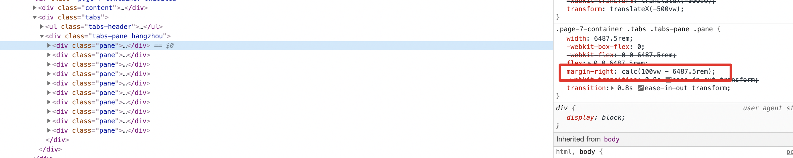

# 关于flex的兼容性问题

我们竟然使用flex进行一维的布局，常常在移动端会用到。但是这不妨碍在pc端上使用flex解决一些布局上的问题。

然而在pc端上使用的时候要注意关于flex的兼容性问题，尤其是ie。

## IE上的flex问题

在一次开发pc端产品引导页的过程中，使用flex对如下进行了布局：

其中大概结构是这样的：

这样的一个布局，在IE11上展示的就很糟糕了。经常排除，发现好像每个`pane`之间的`margn-right`不够，导致堆积在一起了。然而上图能看到，我其实是设置了`margin-right`，只是在chrome等浏览器上展示是ok的，结果在IE上差了很多。

于是我开始查看这个距离到底是多少，结果发现正好差了一个`pane`的距离，也就是我多减了pane的宽度。可是为什么呢？

接着我上网查询关于flex在IE上的bug，有些提到了`flex`这个属性。于是我想到难道是只是设置width是不够的，还需要设置`flex-basis`?、

然而结果并没有我想像的那么甜，依然展示有问题。那么我就考虑，既然差了本体的一个宽度，所以跟flex属性肯定有关，既然设置了flex-basis无效，那么就把flex-shrink和flex-grow都设置一下吧，并且都设置为0，也就是用固定的大小。

结果成功了，简直。。。。。

总之，成功的又踩了一次坑。

最后介绍一个postcss插件，也许有用：https://github.com/luisrudge/postcss-flexbugs-fixes