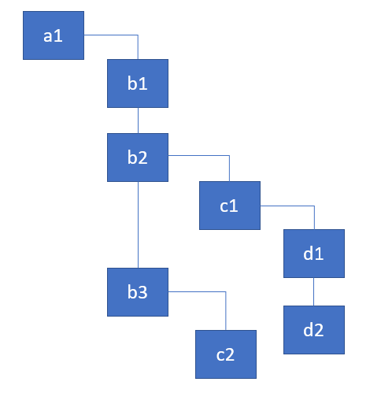
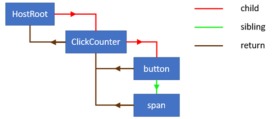

# fiber

## React如何以及为何使用Fiber中的链表来遍历组件树

Fiber架构主要有两个部分：reconciliation/render 和 commit。在源代码中，reconciliation段主要称为“渲染阶段”。这个阶段主要是在React遍历组件🌲以及

* 更新state和props
* 调用生命周期钩子
* 从组件中检索子项
* 比较他们跟之前的子项
* 并计算出需要执行的DOM更新。

以上所有的活动都属于Fiber的工作。需要完成的工作类型取决于React Element的类型。例如，对于类组件，React需要实例化一个类，而不是为功能组件执行它。所有的工作类型如下：

``` js
/**
 * Copyright (c) 2013-present, Facebook, Inc.
 *
 * This source code is licensed under the MIT license found in the
 * LICENSE file in the root directory of this source tree.
 *
 * @flow
 */

export type WorkTag =
  | 0
  | 1
  | 2
  | 3
  | 4
  | 5
  | 6
  | 7
  | 8
  | 9
  | 10
  | 11
  | 12
  | 13
  | 14
  | 15
  | 16;

export const FunctionalComponent = 0;
export const FunctionalComponentLazy = 1;
export const ClassComponent = 2;
export const ClassComponentLazy = 3;
export const IndeterminateComponent = 4; // Before we know whether it is functional or class
export const HostRoot = 5; // Root of a host tree. Could be nested inside another node.
export const HostPortal = 6; // A subtree. Could be an entry point to a different renderer.
export const HostComponent = 7;
export const HostText = 8;
export const Fragment = 9;
export const Mode = 10;
export const ContextConsumer = 11;
export const ContextProvider = 12;
export const ForwardRef = 13;
export const ForwardRefLazy = 14;
export const Profiler = 15;
export const PlaceholderComponent = 16;
```

*在处理UI时，如果一次执行太多工作会出现一个问题，那就是可能会导致动画丢帧...*

那么为什么会这样呢？基本上，如果React要同步遍历整个组件书并为每个组件执行工作，它执行这些逻辑所花费的时间可能会超过16ms。这将导致掉帧，而掉帧会使得页面卡顿。

所以react做的这些工作貌似没有太大帮助嘛？

*较新的浏览器（和React Native）实现了有助于解决这个问题的API ...*

新的API是一个叫做`requestIdleCallback`的全局函数，该函数可用于在浏览器空闲期间执行排在队列里的函数。如下使用：

``` js
requestIdleCallback((deadline) => {
    console.log(deadline.timeRemaining(), deadline.didTimeout);
})
```

如果我现在打开控制台并执行上面的代码，Chrome会记录`49.9 false`。
它基本上告诉我，我有49.9毫秒可以做我需要做的任何工作，我还没有用完所有分配的时间，否则deadline.didTimeout将是`true`。请记住，timeRemaining可以在浏览器完成某些工作后立即更改，因此应该不断检查。


`requestIdleCallback`实际上有点过于严格，并且执行得不够频繁，无法实现流畅的UI呈现，因此React团队必须实现自己的版本。

现在，如果我们将Reacts对组件执行的所有活动放入函数performWork，并使用requestIdleCallback来安排工作，我们的代码可能如下所示：

``` js
requestIdleCallback(deadline => {
    while((deadline.timeRemaining() > 0 || deadline.didTimeout) && nextComponent) {
        nextComponent = performWork(nextComponent);
    }
});
```

我们对一个组件执行工作，然后将返回到要处理的下一个组件进行处理。
如果不是一件事，这将有效。
您无法同步处理整个组件树，如以前的协调算法实现中所示。
这就是安德鲁在这里谈到的问题：

*为了使用这些API，您需要一种方法将渲染的工作分解为增量单元*

因此，为了解决这个问题，React必须重新实现遍历🌲的算法——从依赖于内置堆栈的同步递归模型到具有链表和指针的异步模型的树的算法。

如果你只依赖于[内置]调用堆栈，它将一直工作直到堆栈为空...如果我们可以随意中断调用堆栈并手动操作堆栈帧，那会不会很好？这就是React Fiber的目的。**Fiber是重新实现的堆栈，专门用于React组件。**
您可以将单个fiber视为一个虚拟堆栈帧。

### 关于堆栈

我猜你们都熟悉调用堆栈的概念。
如果您在断点处暂停代码，则可以在浏览器的调试工具中看到。
以下是维基百科的一些相关引用和图表：

*在计算机科学中，调用堆栈是一种堆栈数据结构，它存储有关计算机程序的活动子程序的信息...具有调用堆栈的主要原因是跟踪每个活动子程序在完成执行时应返回控制的点...调用堆栈由堆栈帧组成...每个堆栈帧对应于对尚未以返回终止的子例程的调用。例如，如果一个名为DrawLine的子程序当前正在运行，由子程序DrawSquare调用，则调用堆栈的顶部可能会像在相邻的图片中一样布局。*

[调用堆栈帧](./imgs/1_WqEscsoRHItF0p4fZjHfsA.png)


### 为什么堆栈与React相关？

正如我们在本文的第一部分中所定义的，Reacts在 reconciliation/render 阶段执行组件树，并为组件执行一些工作。协调器的先前实现使用依赖于内置堆栈的同步递归模型来遍历树。关于和解的官方文档描述了这个过程，并谈论了很多关于递归的内容：

*默认情况下，当对DOM节点的子节点进行递归时，React会同时迭代两个子节点列表，并在出现差异时生成突变。*

如果你考虑一下，每个递归调用都会向堆栈添加一个帧。它同步这样做。假设我们有以下组件树：



假设下面的对象都有render函数。你可以将它们视为组件的实例：

``` js
const a1 = {name: 'a1'};
const b1 = {name: 'b1'};
const b2 = {name: 'b2'};
const b3 = {name: 'b3'};
const c1 = {name: 'c1'};
const c2 = {name: 'c2'};
const d1 = {name: 'd1'};
const d2 = {name: 'd2'};

a1.render = () => [b1, b2, b3];
b1.render = () => [];
b2.render = () => [c1];
b3.render = () => [c2];
c1.render = () => [d1, d2];
c2.render = () => [];
d1.render = () => [];
d2.render = () => [];
```

React需要迭代🌲并且对组件做相应的工作。为简化起见，要做的工作是记录当前组件名称并且检索它自己的子组件。下面看一下我们如何递归处理他们：

### 递归遍历

迭代树的主要函数在下面的实现中称为 `walk`：

``` js
walk(a1);

function walk(instance) {
    doWork(instance);
    const children = instance.render();
    children.forEach(walk);
}

function doWork(o) {
    console.log(o.name);
}
```

这是我们得到的输出：

```
a1, b1, b2, c1, d1, d2, b3, c2
```

递归方法直观，非常适合遍历树。但正如我们发现的那样，它有局限性。最大的一点是我们不能将工作分解为增量单位。我们不能暂停特定组件的工作并在以后恢复。使用这种方法，React只是继续迭代，直到它处理所有组件并且堆栈为空。

**那么React如何实现算法在没有递归的情况下遍历树？它使用单链表树遍历算法。它可以暂停遍历并阻止堆栈增长**

### 链表遍历

要实现该算法，我们需要一个包含3个字段的数据结构：

* child —— 代表第一个子项
* sibling —— 代表第一个兄弟项
* return —— 代表父项

在React中的 reconciliation 算法的内容中，具有这些字段的数据结构称为 Fiber。它代表了一个React Element，这个元素用于维持一个候选工作队列。

下图演示了通过链表链接的对象的层次结构以及它们之间的连接类型：


所以让我们首先定义我们的自定义节点构造函数：

``` js
class Node {
    constructor(instance) {
        this.instance = instance;
        this.child = null;
        this.sibling = null;
        this.return = null;
    }
}
```

以及获取节点数组并将它们链接在一起的函数。我们将使用它来链接render方法返回的子节点：

``` js
function link(parent, elements) {
    if (elements === null) elements = [];

    parent.child = elements.reduceRight((previous, current) => {
        const node = new Node(current);
        node.return = parent;
        node.sibling = previous;
        return node;
    }, null);

    return parent.child;
}
```

该函数从最后一个节点开始迭代节点数组，并在单个链表中将它们链接在一起。它返回列表中第一个兄弟的引用。这是一个如何工作的简单演示：

``` js
const children = [{name: 'b1'}, {name: 'b2'}];
const parent = new Node({name: 'a1'});
const child = link(parent, children);

// the following two statements are true
console.log(child.instance.name === 'b1');
console.log(child.sibling.instance === children[1]);
```

我们还将实现一个辅助函数，为节点执行一些工作。在我们的例子中，它将记录组件的名称。但除此之外，它还检索组件的子项并将它们链接在一起：

``` js
function doWork(node) {
    console.log(node.instance.name);
    const children = node.instance.render();
    return link(node, children);
}
```

好的，主要的遍历算法的实现我们已经准备好了。首先是一个父元素，。这里是有用的代码和注释：

``` js
function walk(o) {
    let root = o;
    let current = o;

    while (true) {
        // perform work for a node, retrieve & link the children
        let child = doWork(current);

        // if there's a child, set it as the current active node
        if (child) {
            current = child;
            continue;
        }

        // if we've returned to the top, exit the function
        if (current === root) {
            return;
        }

        // keep going up until we find the sibling
        while (!current.sibling) {

            // if we've returned to the top, exit the function
            if (!current.return || current.return === root) {
                return;
            }

            // set the parent as the current active node
            current = current.return;
        }

        // if found, set the sibling as the current active node
        current = current.sibling;
    }
}
```

虽然实现起来并不是特别难以理解，但您可能需要稍微尝试一下运行代码才能理解它。我们的想法是保持对当前节点的引用，并在下降树时重新分配它，直到我们到达分支的末尾。
然后我们使用 `return` 指针返回公共父级。

如果我们现在使用此代码实现检查调用堆栈，这是我们将要看到的内容：


正如您所看到的，当我们沿着树走时，堆栈不会增长。但是如果现在将调试器放入doWork函数并记录节点名称，我们将看到以下内容：


它看起来像浏览器中的调用栈。因此，使用这种算法，我们可以用我们自己的实现有效地替换浏览器的调用堆栈实现。这就是安德鲁在这里所描述的：

*Fiber是重新实现的堆栈，专门用于React组件。您可以将单个fiber视为虚拟堆栈帧*

因此我们现在通过保留充当顶部帧的节点的引用来控制堆栈。

``` js
function walk(o) {
    let root = o;
    let current = o;

    while (true) {
            ...

            current = child;
            ...
            
            current = current.return;
            ...

            current = current.sibling;
    }
}
```

我们可以随时停止遍历并稍后恢复。这正是我们想要实现的能够使用新的requestIdleCallback API的条件。

### React中的工作循环

这是在React中实现工作循环的代码：

``` js
function workLoop(isYieldy) {
    if (!isYieldy) {
        // Flush work without yielding
        while (nextUnitOfWork !== null) {
            nextUnitOfWork = performUnitOfWork(nextUnitOfWork);
        }
    } else {
        // Flush asynchronous work until the deadline runs out of time.
        while (nextUnitOfWork !== null && !shouldYield()) {
            nextUnitOfWork = performUnitOfWork(nextUnitOfWork);
        }
    }
}
```

如您所见，它很好地映射到我上面提到的算法。它保留对nextUnitOfWork变量中当前光纤节点的引用，该变量充当顶部帧。

该算法可以同步遍历组件树，并为树中的每个光纤节点执行工作（nextUnitOfWork）。这通常是由UI事件（点击，输入等）引起的所谓交互式更新的情况。或者它可以异步地遍历组件树，检查在执行光纤节点工作后是否还剩下时间。函数shouldYield返回基于deadlineDidExpire和deadline变量的结果，这些变量在React为光纤节点执行工作时不断更新。


## 深入Fiber：深入概述React中的新协调算法

React是一个用于构建用户界面的JavaScript库。其核心机制是跟踪组件状态变化并将更新的状态投影到屏幕。在React中，我们将此过程视为**协调（ reconciliation）**。我们调用 `setState` 方法的时候，框架检查 `state` 和 `props` 是否有改变并且在UI上进行重新渲染呈现组件。

React的文档提供了该机制一个不错的高级概述：React元素的作用，生命周期方法和 `render` 方法，以及应用于组件子元素的diffing算法。从render方法返回的不可变React元素树通常称为“虚拟DOM”。这个术语有助于早期向人们解释React，但它也引起了混乱，并且不再在React文档中使用。在本文中，我将坚持称它为React元素的树。

除了React元素的树之外，框架总是有一个用于保持状态的内部实例树（组件，DOM节点等）。从版本16开始，React推出了该内部实例树的新实现以及管理代号为Fiber的算法。

这是本系列的第一篇文章，旨在教你React的内部架构。在本文中，我想提供与算法相关的重要概念和数据结构的深入概述。一旦我们有足够的背景，我们将探索用于遍历和处理fiber树的算法和主要功能。本系列的下一篇文章将演示React如何使用该算法执行初始渲染和处理状态以及道具更新。从那里我们将继续讨论调度程序的详细信息，子协调过程以及构建效果列表的机制。

### 背景

这是一个简单的应用程序，我将在整个系列中使用。我们有一个按钮，只是增加屏幕上呈现的数字：


代码实现如下：

``` js
class ClickCounter extends React.Component {
    constructor(props) {
        super(props);
        this.state = {count: 0};
        this.handleClick = this.handleClick.bind(this);
    }

    handleClick() {
        this.setState((state) => {
            return {count: state.count + 1};
        });
    }


    render() {
        return [
            <button key="1" onClick={this.handleClick}>Update counter</button>,
            <span key="2">{this.state.count}</span>
        ]
    }
}
```

如您所见，它是一个简单的组件，它从render方法返回两个子元素 **button**和 **span**。单击该按钮后，回调函数使得组件的状态更新。紧接着，状态的改变会导致span元素的文本更新。

React在 **reconciliation** 期间执行各种活动。例如，以下是React在我们的简单应用程序中的第一次渲染和状态更新之后执行的高级操作：

* 更新ClickCounter状态中的计数属性
* 检索并比较 **ClickCounter** 和它们的props
* 更新span元素的props

在期 **reconciliation** 间执行的其他活动包括调用生命周期方法或更新 `refs`。**所有这些活动在fiber架构中统称为“工作”**。工作类型通常取决于React元素的类型。例如，对于类组件，React需要创建实例，然而对于函数组件不需要这样做。如您所知，React元素中有许多种类型，例如：类和函数组件，宿主组件（DOM节点），portals等.React元素的类型由createElement函数的第一个参数定义。此函数通常在render方法中被使用，用于创建元素。

在我们开始研究各种工作活动和fiber主要的算法之前，让我们首先熟悉React内部使用的数据结构。

### 从React元素到Fiber节点

在React中每一个组件有一个由 **render** 方法返回的我们称之为视图或者模板的UI表示。对于我们的 **ClickCounter** 组件的模板如下：

``` html
<button key="1" onClick={this.onClick}>Update counter</button>
<span key="2">{this.state.count}</span>
```

### React元素

一旦模板通过JSX编译器编译，你就会得到一堆React元素。这些React元素是从React组件的 `render` 方法返回出来的。如果我们不使用JSX语法，那么我们的 ClickCounter组件的render方法可以像这样重写：

``` js
class ClickCounter {
    ...
    render() {
        return [
            React.createElement(
                'button',
                {
                    key: '1',
                    onClick: this.onClick
                },
                'Update counter'
            ),
            React.createElement(
                'span',
                {
                    key: '2'
                },
                this.state.count
            )
        ]
    }
}
```

在 **render** 方法中调用 **React.createElement** 将创建两个这样的数据结构：

``` js
[
    {
        $$typeof: Symbol(react.element),
        type: 'button',
        key: "1",
        props: {
            children: 'Update counter',
            onClick: () => { ... }
        }
    },
    {
        $$typeof: Symbol(react.element),
        type: 'span',
        key: "2",
        props: {
            children: 0
        }
    }
]
```

你可以看到React将 react元素 作为唯一标识符添加到 `$$typeof`。然后我们`type`、`key`、`props` 来描述元素。这些值取自您传递给React.createElement函数的值。请注意React如何将文本内容表示为span和button节点的子项。以及click处理程序如何成为按钮元素props的一部分。React元素上还有其他字段，如ref字段，超出了本文的范围。

对于 `ClickCounter` 的React元素没有任何props或者key：

``` js
{
    $$typeof: Symbol(react.element),
    key: null,
    props: {},
    ref: null,
    type: ClickCounter
}
```

### Fiber节点

在 reconciliation 阶段，由React元素通过render方法返回的数据被合并到fiber节点树中。每个React元素都有一个相应的fiber节点。不像React元素，在每次渲染中fiber并不会重新创建。它们（fibers）是保存着组件state和dom的可变数据结构。

我们之前讨论过，框架会根据React元素的类型执行不同的任务。在我们的示例应用程序中，对于类组件ClickCounter，它调用生命周期方法和渲染方法，而对于span宿主组件（DOM节点），它执行DOM突变。因此，每个React元素都会转换为相应类型的Fibre节点，用于描述需要完成的工作。

**您可以将fiber节点视为代表某些要做的工作的数据结构，换句话说，就是一个工作单元。Fiber的架构还提供了一种跟踪，安排，暂停和中止工作的便捷方式。**

当React元素第一次转换为fiber节点时，React在[createFiberFromTypeAndProps](https://github.com/facebook/react/blob/769b1f270e1251d9dbdce0fcbd9e92e502d059b8/packages/react-reconciler/src/ReactFiber.js#L414)函数中使用元素中的数据创建fiber。在随后的更新阶段，React使用已存在的fiber节点，并使用来自相应React元素的数据更新必要的属性。如果相应的组件不再从render方法返回中返回，React可能还需要根据key属性移动节点或删除它。

*查看[ChildReconciler](https://github.com/facebook/react/blob/95a313ec0b957f71798a69d8e83408f40e76765b/packages/react-reconciler/src/ReactChildFiber.js#L239)函数以查看React为现有fiber节点执行的所有活动和相应函数的列表。*

因为React为每个React元素创建了一个fiber，并且因为我们有一个这些元素组成的树，所以我们也将拥有一个fiber节点树。对于我们的示例应用程序，它看起来像这样：



所有fiber节点使用在fiber节点里的这些属性通过链表的方式连接：`child`，`sibling`，`return`。关于为什么这样使用，上文已经说过了。

### Current and work in progress trees

在第一次渲染后，React最终得到一个fiber树，它反映了用于呈现UI的应用程序的状态。此时，这棵树通常被称为 **current** （树）。当React在更新阶段开始处理工作，它会构建一个所谓的 **workInProgress** 树，它反映了要刷新到屏幕的未来状态。

所有的工作任务都是在 **workInProgress** 树中的fiber节点上执行。当React遍历current树时，对于每个现有的fiber节点，它会创建一个备用节点用来构成workInProgress树。而这个备用节点使用React元素的render方法返回的数据来创建。一旦处理完更新并完成所有相关工作后，React将有一个备用节点组成的树准备刷新到屏幕上。一旦这个workInProgress树在屏幕上呈现，它就会变成current树。

React的核心原则之一是一致性。React总是一次性的更新完DOM - 它不会显示部分结果。workInProgress树充当用户不可见的“草稿”，因此React可以先处理所有组件，然后将其更改刷新到屏幕。

在源代码中，您将看到很多函数从current树和workInProgress树中获取fiber节点。这是一个这样的功能的签名：

``` js
function updateHostComponent(current, workInProgress, renderExpirationTime) {...}
```

每个fiber节点上的 **alternate** 字段保存着另一个树的对应节点的引用。
当前树中的节点指向workInProgress树中的节点，反之亦然。


## 链接

* https://medium.com/react-in-depth/the-how-and-why-on-reacts-usage-of-linked-list-in-fiber-67f1014d0eb7
* https://medium.com/react-in-depth/inside-fiber-in-depth-overview-of-the-new-reconciliation-algorithm-in-react-e1c04700ef6e （current）
* https://blog.angularindepth.com/what-every-front-end-developer-should-know-about-change-detection-in-angular-and-react-508f83f58c6a
