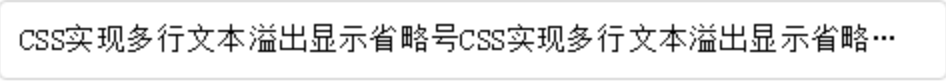

# 关于文本的一些神奇操作

https://juejin.im/entry/5b348990e51d4558cf6e9b46
https://segmentfault.com/a/1190000006159712
https://css-tricks.com/injecting-line-break/

## 开胃小菜——文本后面加省略号

我们经常会遇到这样的需求；*一段文本要单行/多行结尾显示省略号*


### 单行文本

遇到这样的问题，我们通常会想是否能够通过CSS3的属性来实现。首先我们考虑单行文本的溢出显示省略号时候，我们可以通过 `text-overflow: ellipsis` 来实现，然后还需要加上宽度 `width` 来兼容部分浏览器。



``` css
.text-overflow {
    width: 100px;
    overflow: hidden;
    text-overflow: ellipsis;
    white-space: nowrap;
}
```

我们先看看这几个CSS属性。

> `text-overflow`确定如何处理溢出的文本内容。它可能会被剪切显示省略号或者展示自定义的字符。`text-overflow`不会强制内容发生溢出的情况，为了使文本溢出容器，你需要设置一些其他的CSS属性，例如：
> ``` css
>    .demo {
>       overflow: hidden;
>       white-space: nowrap;
>    }
> ```
> 可以使用一个或两个值指定text-overflow属性。如果给出一个值，则它指定行尾的溢出行为（从左到右文本的右端，从右到左文本的左端）。如果给出两个值，则第一个指定行左端的溢出行为，第二个指定行的右端。
> 其属性值有：
> * `clip`、`ellipsis`、`fade`
> * `fade()`函数，传递长度值或百分百值来控制fade的效果。
> * 一个字符串
>
> **属性值**
> * clip: 此属性的默认值。此关键字值将截断内容区域限制的文本，因此截断可能发生在字符的中间。要剪切字符之间的过渡，您可以将文本溢出指定为空字符串，如果目标浏览器支持：text-overflow：'';
> * ellipsis: 此关键字值将显示省略号（'...'，U + 2026 HORIZONTAL ELLIPSIS）以表示剪辑的文本。省略号显示在内容区域内，减少了显示的文本量。如果没有足够的空间来显示省略号，则会对其进行剪裁。
> * `<string>`: 用于表示剪切文本的`<string>`。字符串显示在内容区域内，缩短了显示文本的大小。如果没有足够的空间来显示字符串本身，则会对其进行剪裁。（实际测试貌似并没有用）
> * fade: 此关键字剪切溢出的内联内容，并在线框边缘附近应用淡出效果，边缘处具有完全透明度。

> `white-space`CSS属性2用来设置如何处理元素中的空白。其属性值可能为：normal | pre | nowrap | pre-wrap | pre-line。
> * normal: 连续的空白符会被合并，换行符会被当作空白符来处理。填充line盒子时，必要的话会换行。
> * nowrap: 和 normal 一样，连续的空白符会被合并。但文本内的换行无效。
> * pre: 连续的空白符会被保留。在遇到换行符或者`<br>`元素时才会换行。
> * pre-line: 连续的空白符会被合并。在遇到换行符或者`<br>`元素，或者需要为了填充line盒子时会换行。
> * pre-wrap: 连续的空白符会被保留。在遇到换行符或者`<br>`元素，或者需要为了填充line盒子时才会换行

### 多行文本

看完了这里比较重要的CSS属性后，我们知道如何实现单行文本的溢出显示省略号，如果我们要实现多行文本溢出显示省略号呢？

#### Webkit内核浏览器解决办法

首先，WebKit内核的浏览器实现起来比较简单，可以通过添加一个-webkit-line-clamp的私有属性来实现，-webkit-line-clamp是用来限制在一个块元素显示的文本的行数。 为了实现这个效果，它需要组合其他的WebKit属性：

* `display: -webkit-box`将对象作为弹性伸缩盒子模型显示
* `-webkit-box-orient`设置或者检索伸缩盒子对象的子元素的排列方式
* `text-overflow: ellipsis`用省略号隐藏超出范围的文本

具体代码如下：

``` css
.demo {
    overflow: hidden;
    text-overflow: ellipsis;
    display: -webkit-box;
    -webkit-line-clamp: 2;
    -webkit-box-orient: vetical;
}
```

这个方法合适WebKit浏览器或移动端（绝大部分是WebKit内核的）浏览器，[demo](http://jsfiddle.net/25uk3s9a/?utm_source=website&utm_medium=embed&utm_campaign=25uk3s9a)

#### 其他浏览器的解决方案

目前没有什么CSS的属性可以直接控制多行文本的省略显示，比较靠谱的办法应该就是利用相对定位在最后面加上一个省略号了，代码可以参考下面：

``` css
p {
    position:relative;
    line-height:1.5em;
    /* 高度为需要显示的行数*行高，比如这里我们显示两行，则为3 */
    height:3em;
    overflow:hidden;
}
p:after {
    content:"...";
    position:absolute;
    bottom:0;
    right:0;
    padding: 0 5px;
    background-color: #fff;
}
```

不过这样会有一点问题：

1. 需要知道显示的行数并设置行高才行；
2. IE6/7不支持after和content，需要添加一个标签来代替；
3. 省略号的背景颜色跟文本背景颜色一样，并且可能会遮住部分文字，建议可以使用渐变的png背景图片代替。

### 使用js实现溢出文本省略

对于移动端的多行溢出情况，使用CSS处理还是相当不错的。但是PC端上，由于浏览器的兼容问题，还是很难解决的。主要的问题是：

1. 中文和英文不能简单的通过字符串长度去处理字符串：比如假设100个中文可能满足我们需求，但是100个长度的英文可能只是几个单词，并不能满足我们的需求。
2. 每个中文和英文的宽度不一样，不能通过通过定位简单的盖一个三个点在文字后面的方式实现。

那么我们的解决思路是什么呢？我们的解决思路是用过判断字符的字节的方式来截取字符串；一个中文是2个字节，一个英文1个字节，然后在屏幕的显示过程中我们发现，两个英文的字符显示的宽度和一个中文的宽度差不多（不完全一样，还是会有一些浮动的），那么我们就可按照字节数去截取字符串了。实现代码如下：

``` js
const substrByByte = function(str, num) {
    let bytesCount = 0;
    for (let i = 0; i < str.length; i++) {
        let c = str.charAt(i);
        if (/^[\u0000-\u00ff]$/).test(c)) {
            bytesCount += 1;
        } else {
            bytesCount += 2;
        }

        if (bytesCount > num) {
            return `${str.substr(0, i)}...`;
        } else if (bytesCount === num) {
            return `${str.substr(0, i + 1)}...`;
        }
    }
    return str;
}
```

代码解释： 遍历字符串，如果是中文则字节数+2，非中文+1；然后判断当前的字节数是不是大于咱们需要截取的字节，如果是则截取长度为 i （记住 i 是从0开始的）的字符串拼接上省略号返回；如果等于咱们要截取的字符的话则截取（i + 1）的字符串拼接 省略号返回；如果字符串的字节数小于咱们要截取的字节则把字符串直接返回。

## 来一些变化——一段文本后面加个图标

前段时间做了一个需求：*一段地址信息后面有一个类似这样的箭头`>`，要求箭头的位置在文本内容的结尾。*

对于这个需求，我们可能会很自然的想到把箭头当做文本内容的一部分放在里面。这样它就会一直尾随在文本的末尾。但是这里有个极限状态的问题要处理：**当文本内容达到某一个正好的宽度，导致箭头在新的一行的开头位置。如下图：**


这个时候UI说这个体验有点差啊，这样怎么能行？有没有别的办法来解决呢？当时想了很久，给出的结论是：emmmmmm，无能为力啊，就算修改了宽度也会在某一个极限状态出现这种情况，而且越小的屏幕出现的几率越大。

虽然前端方式貌似没办法（优雅）解决，（ps：因为要解决就要各种计算，很麻烦，也很浪费性能）但是UI提出了一个经验之谈：**一段文本内容后面如果有一个标点符号的话，当处于被换行到新行的时候一定会带一个文字下来**。于是乎我们去尝试了一下，果真是有效的。具体代码如下：

``` html
<div class="box">
    测试测试测试<span class="more"><span class="more-prefix">。</span>></span>
</div>
```

``` css
.more-prefix {
    visibility: hidden;
    position: absolute;
}
```

经过多次尝试发现，无论是中文符合还是英文符合都可以产生一样的效果。但是其原因目前我还是没有研究明白，在网上貌似也没有搜到类似的内容。

## 参考

http://www.daqianduan.com/6179.html
https://developer.mozilla.org/en-US/docs/Web/CSS/text-overflow
http://lomu.me/post/css-multiline-text-overflow
https://juejin.im/entry/5b348990e51d4558cf6e9b46