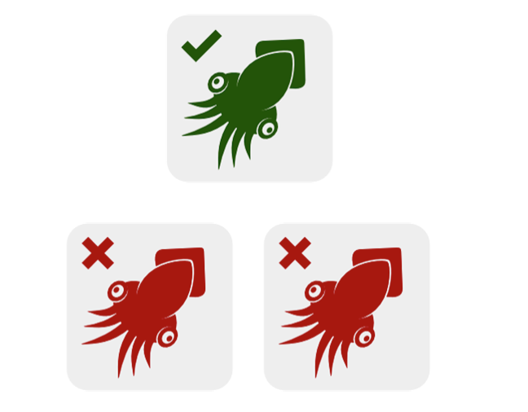

# 量查询

在postcss插件中有一个叫做`postcss-quantity-queries`的插件，它提供了关于数量的查询，例如“至少有n个li元素”。

## 涉及的css知识及插件原理

关于数量查询，应该能想到这些伪类：

* `:first`
* `:first-child`
* `:first-of-type`
* `:last-child`
* `:last-of-child`
* `last-of-type`
* `:not()`
* `:nth-child`
* `:nth-last-child`
* `:nth-last-of-type`
* `:nth-of-type`
* `:only-child`
* `:only-of-type`

### 关于‘数量为一’和‘除了唯一’的时候

在查询元素数量只有一个的时候，我们可以通过`:only-child`和`:only-of-type`来选择。首先看一下关于这两个伪类的说明：

> CSS伪类`:only-child`代表了属于某个父元素的唯一子元素。等效的选择还可以写成`:first-child:last-child`或者`:nth-child(1):nth-last-child(1)`。当然前者的权重会第一点。

然后我们看一个简单的实例：

``` html
<ul>
    <li></li>
</ul>
<ul>
    <li></li>
    <li></li>
</ul>
```

``` css
li:only-child {
    background-position: 0 0;
}
```

*把章鱼当作HTML元素，其中绿色的章鱼表示与CSS选择器匹配的元素（也就是选中的元素），红色的表示是未选中的元素，而灰色的表示不存在的元素。*



很显然，列表ul只要不是一个li时候，都不会选中。

反之，如果想要选中不是唯一子元素的元素（即大于1），就只需要通过`:not()`来实现：


``` css
li:not(:only-child) {
    background-position: 0 0;
}
```

### 关于数量为N个

之前我们能够选择数量为一个和大于一个的元素。而当我们想要选择具体数量的元素的时候（选择元素数量为6的所有元素），我们就需要通过`:nth-last-child(n)`选择器（为什么不是`nth-child`，接下来就知道了）。

首先我们要了解一下关于`nth-child`和`nth-last-child`的信息：

> `:nth-child(an+b)` 这个 CSS 伪类匹配文档树中在其之前具有 `an+b-1` 个兄弟节点的元素，其中 `n` 为正值或零值。简单点说就是，这个选择器匹配那些在同系列兄弟节点中的位置与模式 `an+b` 匹配的元素。
> 示例：
> * 0n+3 或简单的 3 匹配第三个元素。
> * 1n+0 或简单的 n 匹配每个元素。（兼容性提醒：在 Android 浏览器 4.3 以下的版本 n 和 ?1n 的匹配方式不一致。1n 和 1n+0 是一致的，可根据喜好任选其一来使用。）
> * 2n+0 或简单的 2n 匹配位置为 2、4、6、8...的元素。你可以使用关键字 even 来替换此表达式。
> * 2n+1 匹配位置为 1、3、5、7...的元素。你可以使用关键字 odd 来替换此表达式。
> * 3n+4 匹配位置为 4、7、10、13...的元素。
> 
> a 和 b 都必须为整数，并且元素的第一个子元素的下标为 1。换言之就是，该伪类匹配所有下标在集合 { an + b; n = 0, 1, 2, ...} 中的子元素。另外需要特别注意的是，an 必须写在 b 的前面，不能写成 b+an 的形式。

> `:nth-last-child(an+b)`这个css伪类匹配文档树中在其之后具有`an+b-1`个兄弟节点的元素，其中n为正值或零。它基本和`:nth-child`一样，只是它从结尾处反序计数，而不是从开头处。

> 在CSS中`:nth-last-child(n)`选择器可以从后面遍历n个参数。也就是倒数第n个。假设列表中没有n个元素时候，将会直接忽略。（重点的特性）

语法：

* `nth-last-child(<nth> [ of <selector># ]?)`: `<nth> = <an-plus-b> | even | odd`
* `nth-child(<nth> [ of <selector># ]?)`: `<nth> = <an-plus-b> | even | odd`

所以我们可以根据`nth-last-child`的特性（第三条）来确定其元素数量是否是大于n个的情况。我们可以看一个栗子：

``` css
ul li:nth-last-child(6) {
    background-position: 0 0;
}
```

[example](https://codepen.io/airen/pen/LVJJbd)（点开链接查看）。

我们会发现只有当数量大于6个的时候，倒数第六个元素才会被选择到。但是对于我们的目标来说，我们只需要选择数量为6的那一组。如何来做呢？我们可以通过附加条件`:first-child`来实现——只有当数量是大于6个且第一个元素是倒数第六个的时候（这个情况就是数量为6的时候）才会被选中。

``` css
ul li:nth-last-child(6):first-child {
    background-position: 0 0;
}
```

[example](https://codepen.io/airen/pen/Wvggjv)（点开链接查看）

目前我们做到了：

* 数量确定了6个
* 选择到了第一个元素

我们还要把其他的元素选择上才能实现6个元素都被选择的效果，可以使用通用兄弟选择器（`~`）来选择相邻的其他元素。

> 在使用 ~ 连接两个元素时,它会匹配第二个元素,条件是它必须跟(不一定是紧跟)在第一个元素之后,且他们都有一个共同的父元素

例如：

``` css
ul li:nth-last-child(6):first-child ~ li {
    background-position: 0 0;
}
```

[example](https://codepen.io/airen/pen/xGaarY)（点击查看）

既然`:nth-last-child(6):first-child`可以选择到第一个，而`:nth-last-child(6):first-child ~ li`可以选择到第2~6个li。如此一来，将这两个选择器组合在一起，就可以选择只有6个li的列表，也就达到我们需要的目标。

``` css
li:nth-last-child(6):first-child,
li:nth-last-child(6):first-child ~ li {
    background-position: 0 0;
}
```

[example](https://codepen.io/airen/pen/GJXXvL)

于是就有了当想要选择N个元素的时候，可以通过：

``` css
element:nth-last-child(N):first-child,
element:nth-last-child(N):fistt-child ~ element {
    ....
}
```

### 当数量大于或等于N个


由上面所学习到的我们知道，`nth-child(n+6)`可以选择列表中第六个后所有的元素（包括第六个），那么`nth-last-child(n+6)`就可以选择当元素数量大于等于6个（当n=0时候，就是我们之前讨论的情况）时候，从第六个元素往前的所有元素。例如：

``` css
li:nth-last-child(n + 6) {
    background-position: 0 0;
}
```

[example](https://codepen.io/airen/pen/EjdYRM)

这样一来，有六个li的列表会选择倒数第六个，有七个li的列表会选择倒数第6、7 个li,有八个li的列表会选择倒数6~8个li，其他的可以依此类推。

现在我们能选择数量大于6时候，第6个元素之前（包括第6个元素）的所有元素。我们还需要将其后面的元素取到，可以通过通用兄弟选择来实现：

``` css
li:nth-last-child(n + 6),
li:nth-last-child(n + 6) ~ li {
    background-position: 0 0;
}
```

[example](https://codepen.io/airen/pen/gpBYZm)

由此总结一下，获取数量大于等于N的所有元素：

``` css
element:nth-last-child(n + N),
element:nth-last-child(n + N) ~ element {
    ...
}
```

### 当数量小于或等于N

由上面的我们知道`nth-last-child(n + 6)`其实可以理解为其作用区间为[6 - +Infinity]，而当`nth-last-child(-n + 6)`的时候其区间为[0 - 6]。由此我们可以看一个例子：

``` css
li:nth-last-child(-n + 6) {
    background-position: 0 0;
}
```

[example](https://codepen.io/airen/pen/MwPgRz)

无论数量是多少，0到6之间的元素都被选中。而我们希望匹配的数量为6或者小于6的。而对于这种情况，我们上面也有遇见过，可以通过`:first-child`来限制数量。我们可以通过`:nth-last-child(-n + 6):first-child`选择元素为倒数第0-6个同时是第一个元素的情况。例如：

``` css
li:nth-last-child(-n + 6):first-child {
    background-position: 0 0;
}
```

[example](https://codepen.io/airen/pen/YXJzKG)

这时候我们就过滤掉了数量大于6的情况，现在我们选中了所有的符合情况的第一个元素，然后还是通过通用兄弟元素`~`来选取其他的元素就完成了。

``` css
li:nth-last-child(-n + 6):first-child,
li:nth-last-child(-n + 6):first-child ~ li {
    ...
}
```

[example](https://codepen.io/airen/pen/YXJzzG)

总结一下，当选择数量小于等于N的所有元素时候：

``` css
element:nth-last-child(-n + N):first-child,
element:nth-last-child(-n + N):first-child ~ li {
    ...
}
```

### 数量大于N小于M

由上面的我们知道：

* `nth-last-child(n + N)`: 表示选择元素的区间是[N - Infinity]
* `nth-last-child(-n + M)`: 表示选择元素的区间是[0 - M]

那么如果我们想要获取数量大于N小于M的情况，就可以结合这两者以`:first-child`和`~`及来实现。

``` css
li:nth-last-child(n + 4):nth-last-child(-n + 6):first-child,
li:nth-last-child(n + 4):nth-last-child(-n + 6):first-child ~ li {
    ...
}
```

[example](https://codepen.io/airen/pen/aORbOb)

总结来说，当数量大于N小于M的时候：

``` css
element:nth-last-child(n + N):nth-last-child(-n + M):first-child,
element:nth-last-child(n + N):nth-last-child(-n + M):first-child ~ li {
    ...
}
```

### Sass版数量查询

[@Daniel Guillan](http://www.danielguillan.com/)写了一个[Quantity Queries Mixin](https://github.com/danielguillan/quantity-queries)

而postcss插件`postcss-quantity-queries`也是源于这个。

## 关于postcss-quantity-queries

我们既然知道了原理，现在我们看一下关于这个postcss插件的实现。

``` js
export default postcss.plugin('postcss-quantity-queries', () => (css) => {
  css.walk((node) => {
    if (node.type === 'rule') {
      return processRule(node);
    }
    if (node.type === 'atrule') {
      return processAtRule(node);
    }
  });
});
```

插件的开始还是去遍历，不过这次是通过walk方法（遍历所有的节点不区分`rule`还是`atRule`）。然后对于`rule`和`atRule`节点分别处理。

在分析`processRule`和`processAtRule`两个函数之前，我们先看两个正则。

``` js
const rePseudo = /(.*)(?::{1,2})(at-(?:least|most)|between|exactly)/;
const reAtRule = /(at-(?:least|most)|between|exactly)/;
```

第一个正则用于匹配使用了`at-least`、`at-most`、`between`、`exactly`的选择器。

`processRule`用于解析rule类型的节点。

``` js
import balanced from 'balanced-match';
function processRule(rule) {
  if (!rePseudo.test(rule.selector)) return;

  rule.selectors =
  rule.selectors.map((s) => {
    const { pre, body } = balanced('(', ')', s);
    const args = list.comma(body);
    const [selector, quantifier] = pre.split(/:{1,2}/);

    return quantifiers[quantifier](...args)([selector]);
  });
}
```

首先检测选择器是否存在我们规定的选择器，然后遍历选择器，返回处理过后的内容。这其中使用了`balanced-match`库，用于匹配平衡字符串对，如`{`和`}`或者`<b>`和`</b>`，也支持正则。

这样我们通过获取括回之前和括号里的内容，也就是`pre`和`body`。

`body`可能会有`1`或者`1, 2`（between的时候）的形式，所以通过postcss的list模块的comma方法将字符串以逗号为分隔符分隔成数组作为参数。

`pre`是位于括回前的选择符，由两部分组成——（普通的）选择器和我们自定义的选择器，以`:`或者`::`区分。

最后调用对应自定义选择器作为键的quantifiers的方法：

``` js
const quantitySelectors = (quantifier, last) => selectors =>
  selectors.map(s =>
    `${s}${quantifier}, ${s}${quantifier} ~ ${last || list.space(s).pop()}`);
const quantifiers = {
    'at-least': (count, last) =>
        quantitySelectors(`:nth-last-child(n+${count})`, last),

    'at-most': (count, last) =>
        quantitySelectors(`:nth-last-child(-n+${count}):first-child`, last),

    between: (start, end, last) =>
        quantitySelectors(`:nth-last-child(n+${start}):nth-last-child(-n+${end}):first-child`, last),

    exactly: (count, last) =>
        quantitySelectors(`:nth-last-child(${count}):first-child`, last),

};
```

上面的逻辑就是根据不同的自定义选择器创建相应选择器组。

## 参考

[https://www.w3cplus.com/css3/quantity-ordering-with-css.html](https://www.w3cplus.com/css3/quantity-ordering-with-css.html)
[MDN](https://developer.mozilla.org/zh-CN/)
